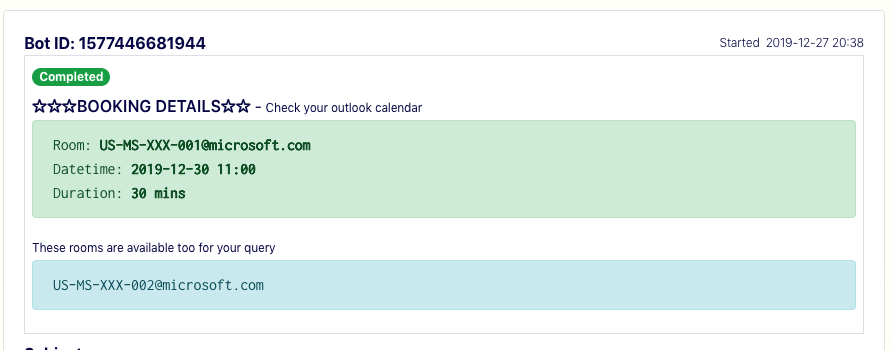
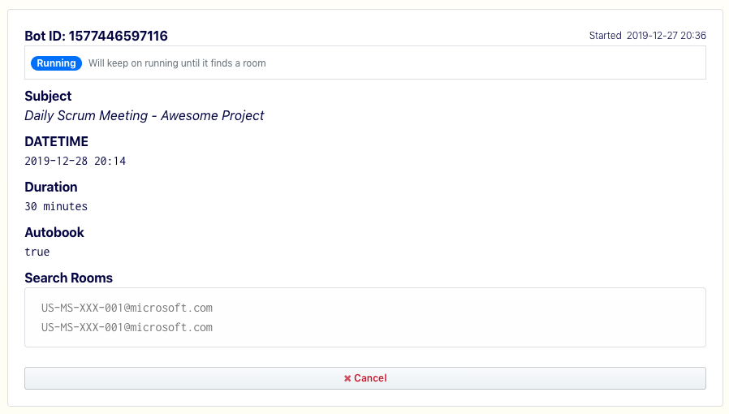

### Document

This tool is intended to save time by automating looking for such empty slots and cancellations. If done manually takes 30 mins to 1 hour of your daily time.
Tool uses exchange API to automate things that you do manually.
Automate finding a meeting room in your office for outlook users.

### How to use

- Medium Article Link

### Downloads

https://github.com/kevincobain2000/outlook-roomfinder/releases

### Screens

#### UI






## Getting started

```
npm install
npm run start
```

```sh
npm run build-all
npm run build-mac
npm run build-linux32
npm run build-linux64
npm run build-win32
npm run build-win64
```